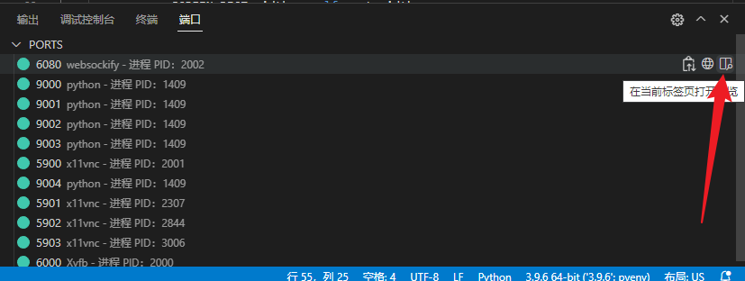
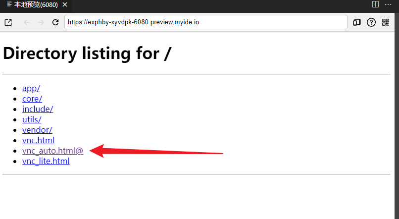
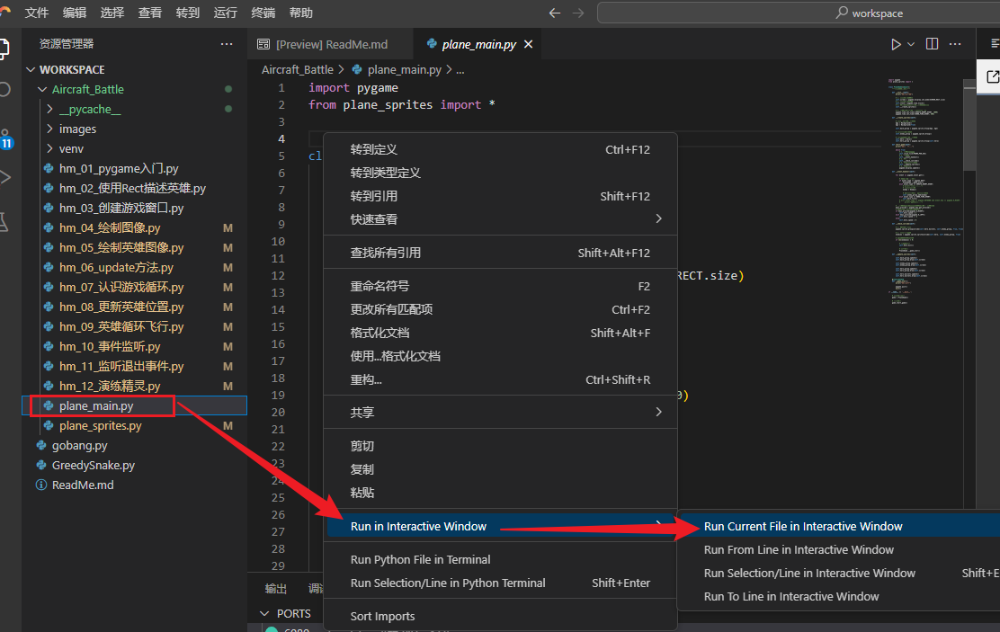
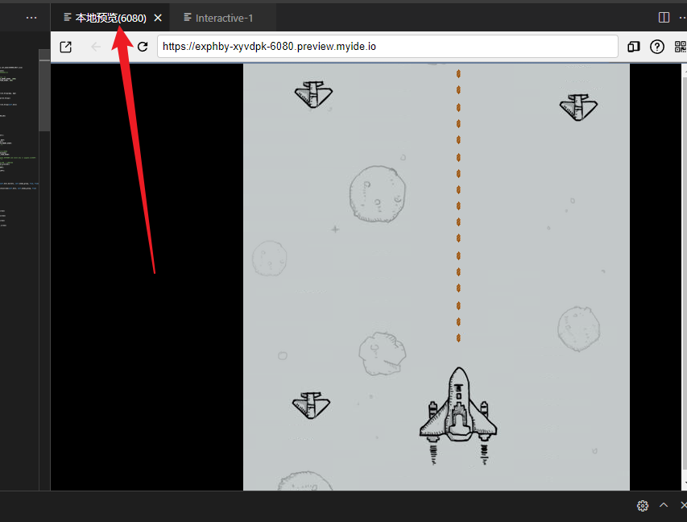

# 1、项目背景
## 本项目来源于《腾讯云 Cloud Studio 实战训练营》的参赛作品，该作品在腾讯云 Cloud Studio 中运行无误。

# 2、项目依赖
* python
* pygame

# 3、项目简介
* Aircraft_battle 为飞机大战小游戏，且其中 plane_main.py 为主程序文件
* gobang.py 为五子棋小程序，运行此文件即可
* Greedy_Snake 为贪吃蛇小程序，运行此文件即可

# 4、项目运行
打开终端
## ①、安装 pygame 库
pip install --index-url https://pypi.tuna.tsinghua.edu.cn/simple pygame 
## ②、启动 vnc 进程
bash /usr/bin/start-vnc-session.sh
## ③、打开 6080 端口本地预览
寻找 6080 端口

选择 vnc_auto.html@

## ④、运行飞机大战项目
选择 plane_main.py 文件 -> 右键 -> Run in Interactive Window -> Run Current File in Interactive Window

打开本地预览(6080)

